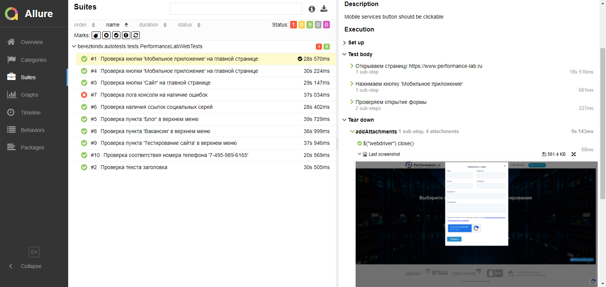

# Проект по автоматизации тестирования для Performance Lab
<a target="_blank" href="https://www.performance-lab.ru/">Вэб сайт Performance Lab</a>

## :pushpin: Содержание:

- [Технологии и инструменты](#earth_africa-технологии-и-инструменты)
- [Реализованные проверки](#earth_africa-Реализованные-проверки)
- [Сборка в Jenkins](#earth_africa-Jenkins-job)
- [Запуск из терминала](#earth_africa-Запуск-тестов-из-терминала)
- [Allure отчет](#earth_africa-Allure-отчет)
- [Отчет в Telegram](#earth_africa-Уведомление-в-Telegram-при-помощи-бота)
- [Видео примеры прохождения тестов](#earth_africa-Примеры-видео-о-прохождении-тестов)

## :rocket: Технологии и инструменты

<p align="center">
<a href="https://www.jetbrains.com/idea/"></a>
<a href="https://www.java.com/"></a>
<a href="https://github.com/"></a>
<a href="https://junit.org/junit5/"></a>
<a href="https://gradle.org/"></a>
<a href="https://selenide.org/"></a>
<a href="https://aerokube.com/selenoid/"></a>
<a href="https://github.com/allure-framework/allure2"></a>
<a href="https://www.jenkins.io/"></a>
</p>

## :scroll: Реализованные проверки

- ✓ Проверка заголовка страницы.
- ✓ Проверка меню "Услуги и продукты".
- ✓ Проверка меню "Вакансии".
- ✓ Проверка пункта меню "Блог".
- ✓ Проверка соответствия номера телефона.
- ✓ Проверка наличия ссылок социальных сетей.
- ✓ Проверка кнопки 'Сайт' на главной странице.
- ✓ Проверка кнопки 'Мобильное приложение' на главной странице.
- ✓ Проверка кнопки 'IT-система' на главной странице.
- ✓ Проверка Проверка лога консоли на наличие ошибок.

## </a> Jenkins job
<a target="_blank" href="https://jenkins.autotests.cloud/job/berezkindv_performance_lab_complete_project/">Сборка в Jenkins</a>
<p align="center">
<a href="https://jenkins.autotests.cloud/job/berezkindv_performance_lab_complete_project/"></a>
</p>

### Параметры сборки в Jenkins:

- browser (браузер, по умолчанию chrome)
- browserVersion (версия браузера, по умолчанию 91.0)
- browserSize (размер окна браузера, по умолчанию 1920x1080)
- browserMobileView (название мобильного устройства, для примера iPhone X)
- remoteDriverUrl (логин, пароль и адрес удаленного сервера selenoid или grid)
- videoStorage (адрес, по которому можно получить видео)
- threads (количество потоков)

## :computer: Запуск тестов из терминала

Локальный запуск:
```bash
gradle clean test
```

Удаленный запуск:
```bash
clean
test
-Dbrowser=${BROWSER}
-DbrowserVersion=${BROWSER_VERSION}
-DbrowserSize=${BROWSER_SIZE}
-DbrowserMobileView="${BROWSER_MOBILE}"
-DremoteDriverUrl=https://${LOGIN}:${PASSWORD}@${REMOTE_DRIVER_URL}/wd/hub/
-DvideoStorage=https://${REMOTE_DRIVER_URL}/video/
-Dthreads=${THREADS}
```

## </a> Allure отчет

### Основное окно

<p align="center">

</p>

### Тесты

<p align="center">

</p>

### Гафики

<p align="center">

</p>

## </a> Уведомление в Telegram при помощи бота

<p align="center">

</p>

### </a> Примеры видео о прохождении тестов

<p align="center">
 
 
</p>
